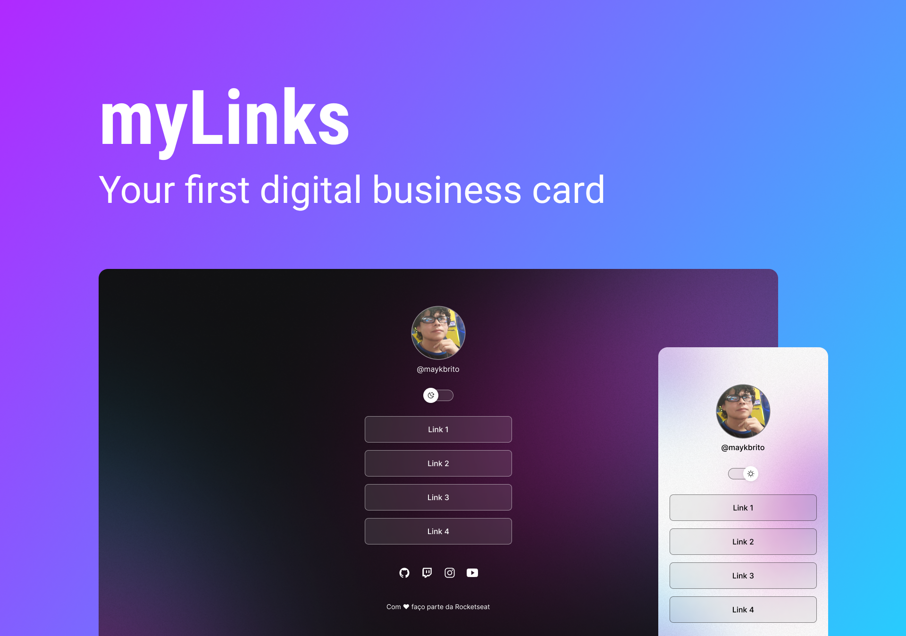

<h1 align="center"> Project myLinks </h1>

A business card that shows all my information

  <a href="#-tecnologias">Technologies</a>&nbsp;&nbsp;&nbsp;|&nbsp;&nbsp;&nbsp;
  <a href="#-projeto">Project</a>&nbsp;&nbsp;&nbsp;|&nbsp;&nbsp;&nbsp;
  <a href="#-layout">Layout</a>&nbsp;&nbsp;&nbsp;|&nbsp;&nbsp;&nbsp;
  <a href="#memo-licença">License</a>

  

 

  

## 🚀 Technologies

This project was developed with the following technologies:

- HTML
- CSS
- JavaScript
- Git e Github
- Figma

## 💻 Project

A simple but beautifully designed business card.

## 🔖 Layout

You can view the project layout through [THIS LINK](https://www.figma.com/file/7qa84Mumnpc5OyhOcSmgzZ/DevLinks-(Community)?node-id=90%3A209&t=nsm3dENynekJBCCG-0). A [Figma](https://figma.com) account is required to access it.

## :memo: License

This project is lisenced under the MIT license.

---

Made with ♥ [Join our community!](https://discord.gg/rocketseat) :wave:
